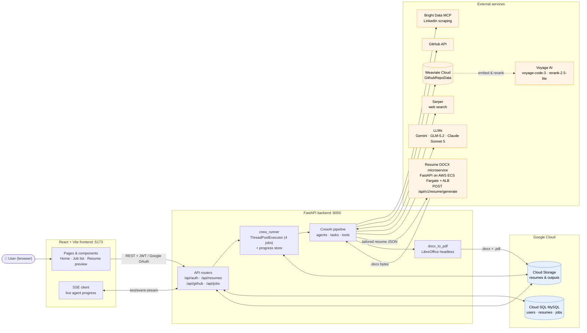
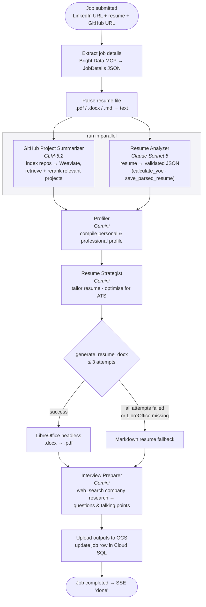
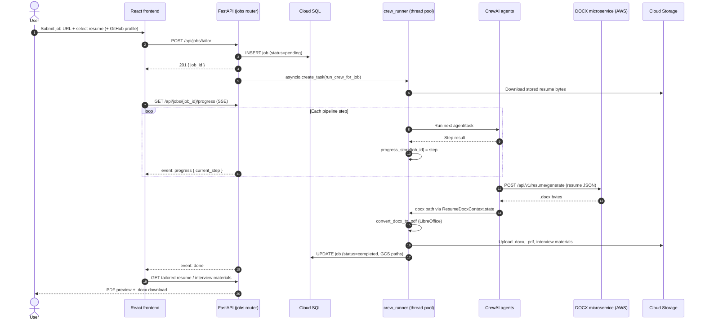

# Job Application Agent

A powerful, multi-agent automation system for job applications, leveraging [Crew AI](https://www.crewai.com/) to orchestrate specialized agents that extract, analyze, and summarize job postings, tailor resumes, and prepare interview materials. Semantic search over your GitHub projects runs on a [Weaviate](https://weaviate.io/) vector store with [Voyage AI](https://www.voyageai.com/) embeddings and reranking, and the system features custom tools for LinkedIn and GitHub data extraction plus Serper-backed web research.

This project also includes a **Full-Stack Web App version** with a **FastAPI backend** (using Google Cloud SQL MySQL and GCS storage) and a **React + Vite frontend** that displays live agent execution progress via Server-Sent Events (SSE).

The final Word (.docx) resume is rendered by a **separate live microservice** deployed on AWS (ECS Fargate behind an ALB) — its source is available at **[arijitde92/resume_docx_generator](https://github.com/arijitde92/resume_docx_generator)**. This backend calls that service over HTTP and converts the returned .docx to PDF locally (LibreOffice headless) for the in-browser preview. See [System Design](#-system-design) for the full picture.

---

## 📦 Project Structure

```
Job_Application_Agent/
├── backend/                # FastAPI backend + CrewAI pipeline (uv-managed)
│   ├── app/
│   │   ├── api/            # Route handlers (api/v1) + shared deps
│   │   ├── core/           # config, security, database, logging
│   │   ├── services/       # GCS, crew runner, CrewAI pipeline, extractors,
│   │   │                   #   vector_store (Weaviate + Voyage)
│   │   ├── models/         # SQLAlchemy ORM models
│   │   ├── schemas/        # Pydantic schemas
│   │   └── main.py         # App init + CORS + routers
│   ├── credentials/        # GCP keys (gitignored)
│   ├── pyproject.toml      # Dependencies (uv)
│   ├── Dockerfile          # (empty for now)
│   └── README.md           # Backend setup & run instructions
├── frontend/               # React + Vite (JavaScript) frontend
│   ├── src/
│   │   ├── components/ pages/ context/ hooks/ services/ assets/
│   │   └── main.jsx App.jsx
│   ├── Dockerfile          # (empty for now)
│   └── package.json
├── .github/workflows/      # CI/CD (deploy.yml — empty for now)
├── docker-compose.yml      # (empty for now)
└── README.md               # This file
```

## ✅ Prerequisites

| Requirement | Version / Notes |
| ----------- | --------------- |
| **Python** | 3.11+ (3.12 recommended). You don't need to install it manually — `uv` will fetch a matching interpreter. |
| **[uv](https://docs.astral.sh/uv/)** | The Python package & project manager used here. Install: `curl -LsSf https://astral.sh/uv/install.sh \| sh` (then restart your shell so `~/.local/bin` is on `PATH`). |
| **Node.js** | 18+ (with `npm`), for the React frontend. [Download](https://nodejs.org/en/download). |
| **Google Cloud account** | A GCP project with the **Cloud SQL Admin** and **Cloud Storage** APIs enabled, plus a **service-account JSON key**. BigQuery and Vertex AI are **no longer required** — the vector store moved off GCP. See [backend/docs/GCP_Setup.md](backend/docs/GCP_Setup.md). |
| **Cloud SQL (MySQL)** | A Cloud SQL MySQL instance (the web app stores users/jobs there). |
| **[Cloud SQL Auth Proxy](https://cloud.google.com/sql/docs/mysql/sql-proxy)** | `cloud-sql-proxy` binary on `PATH` (the `uv run db-proxy` / `uv run dev` commands invoke it). See [Installation](https://docs.cloud.google.com/sql/docs/mysql/connect-instance-auth-proxy) to install|
| **[Weaviate Cloud](https://console.weaviate.cloud/)** | A cluster for the GitHub repo vector store (the free sandbox tier is enough to start). |
| **LibreOffice** | Used headless to convert the generated .docx resume to PDF for the in-browser preview: `sudo apt-get install -y libreoffice-writer fonts-liberation`. Optional — without it the .docx is still generated, the preview just falls back to Markdown. See [backend/README.md](backend/README.md#docx-resume-generation--pdf-preview). |
| **API keys** | GitHub PAT, Bright Data, Gemini, Anthropic, Z.ai, Weaviate, Voyage AI, and Serper. See [API Keys & Cloud Setup](#-api-keys--cloud-setup). |

> **All `uv run` commands are run from the `backend/` directory** — the project
> and its custom commands are defined in `backend/pyproject.toml`. There is no
> root-level `pyproject.toml`, so `uv run dev` from the repo root will not work.

---

## ⚡ Quick Start

```bash
git clone https://github.com/arijitde92/Job_Application_Agent.git
cd Job_Application_Agent
```

### 1. Backend (uv)

```bash
cd backend
cp .env.example .env          # then fill in secrets (see below)
uv sync                       # creates backend/.venv and installs everything
```

Place your GCP service-account JSON key under `backend/credentials/` and point
`GOOGLE_APPLICATION_CREDENTIALS` in `backend/.env` at it (an absolute path is
safest).

### 2. Frontend

```bash
cd ../frontend
cp .env.example .env
npm install
```

### 3. Run everything (from `backend/`)

```bash
cd ../backend
uv run dev                    # Cloud SQL proxy + API + frontend, together
```

Then open **http://localhost:5173**. The API is at http://localhost:8000
(docs at http://localhost:8000/docs).

Prefer separate terminals? Run them individually:

```bash
uv run db-proxy   # Cloud SQL Auth Proxy → 127.0.0.1:3306
uv run api        # FastAPI dev server  → http://localhost:8000
uv run frontend   # Vite dev server     → http://localhost:5173
```

See **[backend/README.md](backend/README.md)** for the full command list,
env-var overrides, and the standalone crew CLI.

---

## 🚀 Features

- **Multi-Agent Orchestration:** Uses Crew AI to coordinate agents for GitHub analysis, resume parsing, profiling, resume tailoring, and interview preparation.
- **Custom Tools:** Includes LinkedIn job extractor, GitHub repo summarizer, and Serper web search, built using Crew AI's extensible tool system.
- **Weaviate + Voyage AI:** Stores and semantically searches GitHub project data in a Weaviate vector store, using Voyage AI's code-specialised `voyage-code-3` embeddings and a `rerank-2.5-lite` second-stage reranker.
- **Structured Resume Parsing:** A dedicated Resume Analyzer agent extracts the resume into a validated JSON schema, deriving years of experience with a deterministic tool rather than LLM arithmetic.
- **Automated Resume Tailoring:** Aligns your resume with job requirements and optimizes for ATS.
- **Polished DOCX + PDF Output:** The Resume Strategist sends the tailored content to a **live document-generation microservice** — a separate FastAPI service running on AWS (ECS Fargate behind an ALB) whose source lives at **[arijitde92/resume_docx_generator](https://github.com/arijitde92/resume_docx_generator)** — which renders a professional Word (.docx) resume. The backend then converts that .docx to PDF locally (LibreOffice headless) for in-browser viewing. Up to 3 attempts; on failure the pipeline gracefully falls back to the Markdown resume.
- **Interview Prep:** Researches the employer on the web, then generates tailored interview questions and talking points.
- **Purpose-Matched LLMs:** Each agent runs on the model that suits its job — Gemini for synthesis, GLM-5.2 for repo analysis, Claude Sonnet 5 for structured extraction.

---

## 🧑‍💻 Agents & Tools

### Crew AI Multi-Agent System

- **Crew AI** ([Homepage](https://www.crewai.com/)): The backbone of the system, enabling modular, collaborative agent workflows.
- **Agents:** (each runs on the LLM best suited to its task — see [backend/app/services/crew/agents.py](backend/app/services/crew/agents.py))

  | Agent | Role | LLM |
  | ----- | ---- | --- |
  | **GitHub Project Summarizer** | Indexes your repos and picks the ones most relevant to the job. | GLM-5.2 (Z.ai) |
  | **Resume Analyzer** | Extracts the resume into validated structured JSON. | Claude Sonnet 5 |
  | **Profiler** | Compiles a comprehensive personal/professional profile. | Gemini |
  | **Resume Strategist** | Tailors your resume for each job. | Gemini |
  | **Interview Preparer** | Researches the employer via web search, then prepares interview questions and talking points. | Gemini |

  The GitHub summary and resume analysis tasks run **in parallel**; profiling waits
  on both. When no GitHub profile is supplied, that agent and its task are skipped
  entirely and the rest run under explicit grounding rules so nothing is fabricated.

### Crew AI Tools Used

- **FileReadTool:** Reads and processes resume files.
- **ScrapeWebsiteTool:** Scrapes web content for job and company info.
- **MDXSearchTool:** Performs semantic search on resume content.
- **SerperDevTool:** Web search for the Resume Strategist.

### Custom Tools

- **LinkedIn Job Extractor:** Scrapes and parses job details from LinkedIn job postings.
- **GitHub Repos Extractor:** Recursively fetches and summarizes public GitHub repositories for a user.
- **Web Search (`web_search`):** Serper-backed Google search used by the Interview
  Preparer to research the employer's interview process, role-specific questions,
  and recent company news. Returns a compact ranked digest (featured answer +
  title/URL/snippet) rather than Serper's raw JSON. It never raises: if the key is
  missing or the API fails it returns an `ERROR: ...` observation and the agent
  falls back to the resume and job details alone, so a search outage cannot sink a
  run whose resume tailoring has already completed.
- **Weaviate/Voyage AI Integration:** Custom logic to chunk, embed, upsert, and search GitHub repo content — one shared Weaviate collection, with every search scoped to the applicant's own repositories.
- **Resume Tools:** A `calculate_yoe` tool for deterministic years-of-experience arithmetic and a per-run `save_parsed_resume` tool that validates the JSON against the schema before persisting it.
- **DOCX Generator (`generate_resume_docx`):** A per-run tool for the Resume Strategist that POSTs the tailored resume JSON to the live document-generation microservice (`POST /api/v1/resume/generate` on [arijitde92/resume_docx_generator](https://github.com/arijitde92/resume_docx_generator)) and saves the returned Word (.docx) resume. The tool wraps the agent's content in the service's metadata envelope deterministically and enforces a 3-attempt retry cap, after which the run falls back to Markdown output.

---

## 🏗️ Architecture

- **Python 3.11+** with **[uv](https://docs.astral.sh/uv/)** for dependency &
  environment management (see `backend/pyproject.toml`)
- **FastAPI** backend (async SQLAlchemy + Cloud SQL MySQL, JWT/Google OAuth auth)
- **React + Vite** frontend with live progress via Server-Sent Events (SSE)
- **Crew AI** for agent orchestration, across **Gemini**, **GLM-5.2** (Z.ai) and
  **Claude Sonnet 5** depending on the agent
- **Weaviate Cloud** as the vector store for GitHub repo embeddings
- **Voyage AI** for code-specialised embeddings (`voyage-code-3`) and reranking
  (`rerank-2.5-lite`)
- **Google Cloud Storage** for resume & generated-output storage
- **Resume DOCX microservice** — a standalone FastAPI service on AWS ECS Fargate
  that renders the tailored resume JSON into a Word document
  ([source](https://github.com/arijitde92/resume_docx_generator)); the backend
  converts the returned .docx to PDF with **LibreOffice headless**
- **Bright Data MCP** for LinkedIn job scraping; **LangChain** for document
  loading and chunking

---

## 🧭 System Design

### Component architecture



### Agent pipeline (one job run)



> The GitHub agent and its task are **skipped entirely** when no GitHub profile is
> supplied; the remaining agents then run under explicit grounding rules.

### Request lifecycle



---

## ⚙️ Configuration

All backend configuration lives in **`backend/.env`** (copy it from
`backend/.env.example`). Key groups:

```env
# ── GCP ──────────────────────────────────────────────────────────
GOOGLE_APPLICATION_CREDENTIALS=/abs/path/to/backend/credentials/service-account.json
GCP_PROJECT_ID=your-project-id
GCP_LOCATION=asia-south2

# ── Vector store (Weaviate Cloud + Voyage AI — not GCP) ──────────
WEAVIATE_URL=...                 # cluster REST endpoint; scheme optional
WEAVIATE_API_KEY=...
WEAVIATE_COLLECTION_NAME=GithubRepoData
VOYAGE_API_KEY=...               # embeddings + reranking
VOYAGE_EMBED_MODEL=voyage-code-3
VOYAGE_EMBED_DIMENSION=1024
VOYAGE_RERANK_MODEL=rerank-2.5-lite

# ── API keys ─────────────────────────────────────────────────────
GITHUB_PERSONAL_ACCESS_TOKEN=...
BRIGHT_DATA_API_KEY=...          # LinkedIn scraping (Bright Data MCP)
GEMINI_API_KEY=...               # Profiler / Strategist / Interview Preparer
ANTHROPIC_API_KEY=...            # Resume Analyzer (Claude Sonnet 5)
ZAI_API_KEY=...                  # GitHub Project Summarizer (GLM-5.2)
ZAI_BASE_URL=                    # optional override; blank = https://api.z.ai/api/paas/v4
SERPER_API_KEY=...               # web search (Interview Preparer research)

# ── Resume DOCX generation microservice ──────────────────────────
# Live service on AWS (ECS Fargate + ALB). Source & self-hosting instructions:
#   https://github.com/arijitde92/resume_docx_generator
RESUME_DOCX_SERVICE_URL=http://resume-service-alb-1115872566.us-east-2.elb.amazonaws.com/api/v1/resume/generate
RESUME_DOCX_TIMEOUT_SECONDS=120

# ── Cloud SQL (MySQL) ────────────────────────────────────────────
MYSQL_HOST=127.0.0.1             # 127.0.0.1 when using the Cloud SQL Auth Proxy
MYSQL_PORT=3306
MYSQL_USER=...
MYSQL_PASSWORD=...
MYSQL_DATABASE=job_applier

# ── GCS / Auth ───────────────────────────────────────────────────
GCS_BUCKET_NAME=your-resumes-bucket
JWT_SECRET_KEY=                  # generate: python -c "import secrets; print(secrets.token_urlsafe(32))"
GOOGLE_OAUTH_CLIENT_ID=          # optional, for "Sign in with Google"
GOOGLE_OAUTH_CLIENT_SECRET=
```

The frontend has its own `frontend/.env` (copy from `frontend/.env.example`) for
`VITE_*` variables.

> **Never commit `.env` or service-account keys.** They are gitignored. The
> `db-proxy` connection name is derived from `GCP_PROJECT_ID`, `GCP_LOCATION`,
> and instance `job-applier-mysql` by default — override with `CLOUD_SQL_INSTANCE`
> if yours differs.

For step-by-step GCP provisioning (project, Cloud SQL instance, GCS bucket,
service account), see **[backend/docs/GCP_Setup.md](backend/docs/GCP_Setup.md)**.

---

## 🖥️ Standalone Crew CLI (no web app)

You can run the agent pipeline directly, without the frontend/DB, from `backend/`:

```bash
cd backend
uv run crew \
    --url https://www.linkedin.com/jobs/view/<id>/ \
    --github https://github.com/<user> \
    --resume sample_data/Arijit_De_Resume.md \
    --name "Your Name"
```

This extracts the job, indexes the GitHub repos into Weaviate, parses and tailors
the resume, and writes interview materials — same pipeline the web app drives.

---

## 🔑 API Keys & Cloud Setup

All keys go in `backend/.env`.

- **GitHub:** [Create a Personal Access Token](https://github.com/settings/tokens) → `GITHUB_PERSONAL_ACCESS_TOKEN`.
- **Google Cloud:**
  - Enable the **Cloud SQL Admin** and **Cloud Storage** APIs. BigQuery and Vertex AI are no longer used.
  - Create a service account with the relevant roles (Cloud SQL Client, Storage Object Admin).
  - Download the JSON key into `backend/credentials/` and point `GOOGLE_APPLICATION_CREDENTIALS` at it.
- **Weaviate:** Create a cluster at [Weaviate Cloud](https://console.weaviate.cloud/) → `WEAVIATE_URL` + `WEAVIATE_API_KEY` (GitHub repo vector store).
- **Voyage AI:** [Get an API key](https://www.voyageai.com/) → `VOYAGE_API_KEY` (embeddings + reranking for the GitHub RAG pipeline).
- **Gemini:** [Get a Gemini API key](https://aistudio.google.com/app/apikey) → `GEMINI_API_KEY` (Profiler, Resume Strategist, Interview Preparer, and the RAGAS judge).
- **Anthropic:** [Get an API key](https://console.anthropic.com/) → `ANTHROPIC_API_KEY` (the Resume Analyzer runs on Claude Sonnet 5).
- **Z.ai:** [Get an API key](https://z.ai/) → `ZAI_API_KEY` (the GitHub Project Summarizer runs on GLM-5.2).
- **Bright Data:** [Get an API key](https://brightdata.com/) for the MCP scraper → `BRIGHT_DATA_API_KEY` (LinkedIn job extraction).
- **Serper:** [Get a Serper API key](https://serper.dev/) → `SERPER_API_KEY` (the `web_search` tool). Strictly optional — without it the crew still runs end to end, but the Interview Preparer loses its company research and works from the resume and job details alone.

---

## 📚 How it Works

1. **Job Extraction:** The job posting is scraped once via the Bright Data MCP LinkedIn extractor and parsed into structured `JobDetails`, which are injected into every downstream task.
2. **GitHub Analysis & Resume Parsing (in parallel):** The GitHub Project Summarizer chunks and indexes your public repos into Weaviate with Voyage embeddings, then retrieves and reranks the projects most relevant to the job. Meanwhile the Resume Analyzer extracts your resume into validated structured JSON.
3. **Profile Compilation:** The Profiler agent creates a comprehensive profile using the parsed resume, GitHub summaries, and job requirements.
4. **Resume Tailoring:** The Resume Strategist aligns your resume with the job description, then renders it as a polished Word (.docx) resume via the live document-generation microservice (`generate_resume_docx` tool, max 3 attempts) — the .docx is converted to PDF with LibreOffice for the in-browser preview, and the Markdown version remains the fallback when the service or conversion is unavailable. The microservice is a separate FastAPI app deployed on AWS ECS Fargate; its source is at **[arijitde92/resume_docx_generator](https://github.com/arijitde92/resume_docx_generator)**.
5. **Interview Prep:** The Interview Preparer researches the company's interview process and role-specific questions with the `web_search` tool, then generates custom interview questions and talking points grounded in your tailored resume — citing sources for anything it found on the web.

---

## 🛠️ Extending the System

- Add new agents or tools by following the Crew AI documentation.
- Integrate additional data sources or cloud services as needed.

---

## 📄 License

MIT License

---

## 🤝 Acknowledgements

- [Crew AI](https://www.crewai.com/)
- [resume_docx_generator](https://github.com/arijitde92/resume_docx_generator) — the companion .docx rendering microservice
- [Weaviate](https://weaviate.io/)
- [Voyage AI](https://www.voyageai.com/)
- [LangChain](https://python.langchain.com/)
- [BeautifulSoup](https://www.crummy.com/software/BeautifulSoup/)
