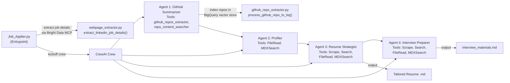
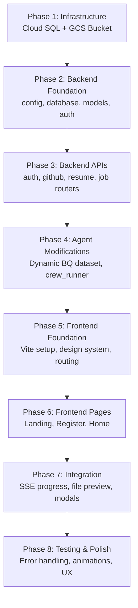

# Job Application Agent — Full-Stack Web Application Plan

Build a production-grade web interface for the existing CrewAI-based Job Application Agent using **FastAPI** (backend), **React + Vite** (frontend), **Google Cloud SQL for MySQL** (user data), and **Google Cloud Storage** (resume files).

---

## Resolved Decisions

| Decision | Resolution |
|----------|------------|
| **GCP Region** | `asia-south2` for all resources (Cloud SQL, GCS, BigQuery) |
| **Cloud SQL Tier** | `db-f1-micro` (cheapest, ~$7/mo) |
| **Authentication** | JWT + OAuth (Google Sign-In) |
| **BQ Dataset Naming** | Sanitized: `arijitde2050_gmail_com_github_bq_db` |
| **Interview Materials** | Stored in GCS + tracked in `jobs` table |
| **GCS Bucket Name** | `job-applier-<project-id>-resumes` |
| **Max Resume Upload** | 10 MB |
| **Concurrency** | Concurrent crew executions (asyncio + thread pool) |
| **Deployment** | Dockerized → GCP Cloud Run |

---

## Current Architecture Understanding

### Existing Agent Pipeline



**Key observations:**
- `Job_Applier.py` pre-fetches job details via `extract_linkedin_job_details()` then passes JSON to all crew tasks
- `github_repo_extractor.py` uses `GithubFileLoader` → Vertex AI embeddings → BigQuery vector store
- BigQuery dataset/table are configured via env vars (`GCP_DATASET_NAME`, `GCP_TABLE_NAME`)
- The crew outputs a tailored resume as `{applicant_name}_{company_name}_{job_name}_resume.md` locally
- LLM: Gemini 2.5 Flash via `gemini/gemini-2.5-flash`

---

## Proposed Changes

### New Directory Structure

```
Job_Application_Agent/
├── backend/                    # FastAPI application
│   ├── __init__.py
│   ├── main.py                 # FastAPI app entry point, CORS, lifespan
│   ├── config.py               # Settings from env vars (Pydantic BaseSettings)
│   ├── database.py             # SQLAlchemy engine, session, Base
│   ├── models.py               # SQLAlchemy ORM models (users, github, resumes, jobs)
│   ├── schemas.py              # Pydantic request/response schemas
│   ├── auth.py                 # JWT token creation, password hashing, auth deps
│   ├── gcs.py                  # GCS upload/download helpers
│   ├── crew_runner.py          # Crew execution wrapper with progress callbacks
│   ├── requirements.txt        # Backend-specific dependencies
│   └── routers/
│       ├── __init__.py
│       ├── auth_router.py      # POST /register, POST /login
│       ├── github_router.py    # POST /github, GET /github, DELETE /github
│       ├── resume_router.py    # POST /resume/upload, GET /resumes, DELETE /resume
│       └── job_router.py       # POST /job/tailor, GET /jobs, GET /job/{id}/status
├── frontend/                   # React + Vite application
│   ├── index.html
│   ├── package.json
│   ├── vite.config.js
│   ├── public/
│   └── src/
│       ├── main.jsx
│       ├── App.jsx
│       ├── App.css
│       ├── index.css           # Global design tokens
│       ├── api/
│       │   └── client.js       # Axios instance with JWT interceptor
│       ├── context/
│       │   └── AuthContext.jsx  # Auth state management
│       ├── pages/
│       │   ├── LandingPage.jsx           # USP, hero, features, sign-up/login
│       │   ├── RegisterPage.jsx          # User registration form
│       │   ├── HomePage.jsx              # Dashboard after login
│       │   └── InterviewMaterialsPage.jsx # View interview materials (markdown)
│       └── components/
│           ├── Navbar.jsx
│           ├── LoginSection.jsx
│           ├── ResumeUpload.jsx
│           ├── GithubProfileAdd.jsx
│           ├── TailoredResumeList.jsx
│           ├── TailorResumeForm.jsx
│           ├── ProgressTracker.jsx
│           ├── ResumePreviewModal.jsx
│           └── ResumeReadyModal.jsx
├── agents.py                   # MODIFIED — accept dynamic DB name
├── tasks.py                    # MODIFIED — dynamic output paths
├── github_repo_extractor.py    # MODIFIED — accept DB name parameter
├── webpage_extractor.py        # Unchanged
├── logger.py                   # Unchanged
├── Job_Applier.py              # Kept for standalone CLI usage
└── requirements.txt            # Existing (unchanged)
```

---

### Component 1: Google Cloud Infrastructure

#### GCS Bucket Setup

Create a single GCS bucket with the following folder structure:
```
gs://<bucket-name>/
├── uploads/
│   └── <user_id>/              # User-uploaded original resumes
│       └── <resume_filename>.md
└── tailored/
    └── <user_id>/              # Agent-generated tailored resumes
        └── <job_id>_<company>_<jobtitle>_resume.md
```

**Setup command:**
```bash
gsutil mb -l asia-south2 -c STANDARD gs://job-applier-<project-id>-resumes
gsutil uniformbucketlevelaccess set on gs://job-applier-<project-id>-resumes
```

#### Cloud SQL for MySQL Setup

- Instance name: `job-applier-mysql`
- MySQL version: 8.0
- Region: `asia-south2`
- Add the service account and app's IP to authorized networks

---

### Component 2: Database Schema (Cloud SQL MySQL)

#### [NEW] [models.py](file:///home/arijit/Documents/github/Job_Application_Agent/backend/models.py)

```sql
-- users table
CREATE TABLE users (
    id            INT AUTO_INCREMENT PRIMARY KEY,
    first_name    VARCHAR(100) NOT NULL,
    last_name     VARCHAR(100) NOT NULL,
    email         VARCHAR(255) NOT NULL UNIQUE,
    password_hash VARCHAR(255) NOT NULL,
    created_at    TIMESTAMP DEFAULT CURRENT_TIMESTAMP,
    updated_at    TIMESTAMP DEFAULT CURRENT_TIMESTAMP ON UPDATE CURRENT_TIMESTAMP,
    INDEX idx_email (email)
);

-- github_profiles table
CREATE TABLE github_profiles (
    id              INT AUTO_INCREMENT PRIMARY KEY,
    user_id         INT NOT NULL,
    github_username VARCHAR(100) NOT NULL,
    github_url      VARCHAR(500) NOT NULL,
    bq_dataset_name VARCHAR(255) NOT NULL,  -- e.g. "user_email_github_bq_db"
    created_at      TIMESTAMP DEFAULT CURRENT_TIMESTAMP,
    FOREIGN KEY (user_id) REFERENCES users(id) ON DELETE CASCADE,
    UNIQUE KEY uq_user_github (user_id, github_username)
);

-- resumes table
CREATE TABLE resumes (
    id              INT AUTO_INCREMENT PRIMARY KEY,
    user_id         INT NOT NULL,
    original_filename VARCHAR(255) NOT NULL,
    gcs_path        VARCHAR(500) NOT NULL,  -- gs://bucket/uploads/<user_id>/<filename>.md
    uploaded_at     TIMESTAMP DEFAULT CURRENT_TIMESTAMP,
    FOREIGN KEY (user_id) REFERENCES users(id) ON DELETE CASCADE
);

-- jobs table
CREATE TABLE jobs (
    id                    INT AUTO_INCREMENT PRIMARY KEY,
    user_id               INT NOT NULL,
    github_profile_id     INT NOT NULL,
    resume_id             INT NOT NULL,
    linkedin_job_url      VARCHAR(500) NOT NULL,
    job_name              VARCHAR(255),
    company_name          VARCHAR(255),
    location              VARCHAR(255),
    seniority_level       VARCHAR(100),
    employment_type       VARCHAR(100),
    job_function          VARCHAR(255),
    industry              VARCHAR(255),
    job_description       TEXT,
    requirements          TEXT,
    tailored_resume_gcs_path       VARCHAR(500),  -- gs://bucket/tailored/<user_id>/<job_id>_resume.md
    interview_materials_gcs_path   VARCHAR(500),  -- gs://bucket/tailored/<user_id>/<job_id>_interview.md
    status                ENUM('pending','processing','completed','failed') DEFAULT 'pending',
    error_message         TEXT,
    created_at            TIMESTAMP DEFAULT CURRENT_TIMESTAMP,
    completed_at          TIMESTAMP NULL,
    FOREIGN KEY (user_id) REFERENCES users(id) ON DELETE CASCADE,
    FOREIGN KEY (github_profile_id) REFERENCES github_profiles(id) ON DELETE RESTRICT,
    FOREIGN KEY (resume_id) REFERENCES resumes(id) ON DELETE RESTRICT
);
```

**Key design decisions:**
- `github_profiles` and `resumes` use `ON DELETE CASCADE` — deleting a user removes their profiles/resumes
- `jobs` uses `ON DELETE RESTRICT` for `github_profile_id` and `resume_id` — can't delete a github profile or resume that has been used in a job application
- `jobs.status` tracks crew execution state for progress UI
- `bq_dataset_name` stored per github profile so the system knows which BQ dataset to query

---

### Component 3: FastAPI Backend

#### [NEW] [config.py](file:///home/arijit/Documents/github/Job_Application_Agent/backend/config.py)

Pydantic `BaseSettings` loading from `.env`:
- `MYSQL_HOST`, `MYSQL_PORT`, `MYSQL_USER`, `MYSQL_PASSWORD`, `MYSQL_DATABASE`
- `GCS_BUCKET_NAME`
- `JWT_SECRET_KEY`, `JWT_ALGORITHM=HS256`, `JWT_EXPIRY_MINUTES=1440`
- `GOOGLE_OAUTH_CLIENT_ID`, `GOOGLE_OAUTH_CLIENT_SECRET`
- All existing env vars (GCP project, Gemini key, Bright Data key, etc.)

#### [NEW] [database.py](file:///home/arijit/Documents/github/Job_Application_Agent/backend/database.py)

- SQLAlchemy async engine with `asyncmy` driver connecting to Cloud SQL
- Session factory, dependency injection via `get_db()`
- `Base.metadata.create_all()` for table creation on startup

#### [NEW] [auth.py](file:///home/arijit/Documents/github/Job_Application_Agent/backend/auth.py)

- `hash_password(plain)` → bcrypt hash
- `verify_password(plain, hashed)` → bool
- `create_access_token(user_id, email)` → JWT string
- `get_current_user(token)` → FastAPI dependency that extracts & validates JWT
- `google_oauth_login(id_token)` → Verify Google OAuth ID token, create/find user, return JWT
- Uses `google-auth` library to verify Google ID tokens server-side
- On first Google OAuth login, creates a user record (password_hash set to empty — OAuth-only users)

#### [NEW] [gcs.py](file:///home/arijit/Documents/github/Job_Application_Agent/backend/gcs.py)

- `upload_resume(user_id, file_bytes, filename)` → returns `gcs_path` (max 10MB enforced)
- `upload_tailored_resume(user_id, job_id, content, filename)` → returns `gcs_path`
- `upload_interview_materials(user_id, job_id, content, filename)` → returns `gcs_path`
- `download_file(gcs_path)` → returns file bytes
- `generate_signed_url(gcs_path, expiry_minutes=15)` → returns presigned URL for preview

#### [NEW] [crew_runner.py](file:///home/arijit/Documents/github/Job_Application_Agent/backend/crew_runner.py)

Wraps the existing crew execution with progress tracking:

```python
async def run_crew_for_job(job_id, user, github_profile, resume_gcs_path, job_url):
    """
    1. Update job status to 'processing'
    2. Extract job details via extract_linkedin_job_details()
    3. Store extracted details in jobs table
    4. Download user's resume from GCS to temp file
    5. Build crew inputs (dynamic BQ dataset name from github_profile)
    6. Kick off crew with progress callbacks
    7. Upload tailored resume to GCS
    8. Update job record with tailored_resume_gcs_path, status='completed'
    """
```

**Concurrency**: Each crew execution runs in a `ThreadPoolExecutor` thread via `asyncio.run_in_executor()`, allowing multiple users to tailor resumes simultaneously.

**Progress tracking via SSE (Server-Sent Events):**
- Each crew step updates a shared dict `progress_store[job_id]`
- Steps: `extracting_job_info` → `indexing_github_repos` → `searching_projects` → `building_profile` → `tailoring_resume` → `generating_interview_prep` → `uploading_results` → `completed`
- Frontend connects via `GET /api/jobs/{id}/progress` (SSE endpoint)

#### API Endpoints Summary

| Method | Endpoint | Description |
|--------|----------|-------------|
| `POST` | `/api/auth/register` | Create new user account |
| `POST` | `/api/auth/login` | Login, returns JWT token |
| `POST` | `/api/auth/google` | Google OAuth login/register |
| `GET` | `/api/auth/me` | Get current user profile |
| `POST` | `/api/github` | Add a GitHub username |
| `GET` | `/api/github` | List user's GitHub profiles |
| `DELETE` | `/api/github/{id}` | Remove a GitHub profile |
| `POST` | `/api/resumes/upload` | Upload a `.md` resume to GCS |
| `GET` | `/api/resumes` | List user's uploaded resumes |
| `GET` | `/api/resumes/{id}/preview` | Get signed URL for resume preview |
| `DELETE` | `/api/resumes/{id}` | Delete a resume (if not used in a job) |
| `POST` | `/api/jobs/tailor` | Start crew execution for a job |
| `GET` | `/api/jobs` | List user's tailored jobs |
| `GET` | `/api/jobs/{id}` | Get job details + tailored resume URL |
| `GET` | `/api/jobs/{id}/progress` | SSE stream for crew progress |
| `GET` | `/api/jobs/{id}/resume/download` | Download tailored resume .md file |
| `GET` | `/api/jobs/{id}/interview/download` | Download interview materials .md file |
| `GET` | `/api/jobs/{id}/interview/content` | Get interview materials markdown content for in-browser viewing |

---

### Component 4: Existing Code Modifications

#### [MODIFY] [github_repo_extractor.py](file:///home/arijit/Documents/github/Job_Application_Agent/github_repo_extractor.py)

- `process_github_repo_to_bq()`: Add optional `dataset_name` parameter (defaults to env var for backward compatibility). When called from the web app, pass the user-specific dataset name.
- `query_github_vector_store()`: Same — add optional `dataset_name` parameter.

#### [MODIFY] [agents.py](file:///home/arijit/Documents/github/Job_Application_Agent/agents.py)

- Refactor `extract_github_repos_tool` and `repo_content_searcher` to accept `dataset_name` as a parameter (passed via crew input variables).
- The tools will use the user-specific BQ dataset when called from the web app.

#### [MODIFY] [tasks.py](file:///home/arijit/Documents/github/Job_Application_Agent/tasks.py)

- `resume_strategy_task`: Change `output_file` to a temp path that the web app can read and upload to GCS.
- Add `{bq_dataset_name}` as a crew input variable passed to tasks that use BQ.

---

### Component 5: React Frontend

#### Design System

- **Font**: Inter (Google Fonts)
- **Color Palette**: Dark mode primary with vibrant accents
  - Background: `#0a0a0f` (deep navy-black)
  - Surface: `#13131a` / `#1a1a2e`
  - Primary accent: `#6c63ff` (vibrant indigo)
  - Secondary accent: `#00d4aa` (teal-green for success)
  - Text: `#e8e8f0` / `#9898a8` (muted)
  - Error: `#ff4757`
- **Effects**: Glassmorphism cards, subtle gradient borders, smooth transitions

#### Page: Landing Page (`LandingPage.jsx`)

**Sections:**
1. **Hero Section**: Full-width gradient background with animated particles or subtle mesh gradient. Large headline: *"Your Dream Job Deserves a Perfect Resume"*, sub-headline addressing the pain points. CTA buttons for Sign Up / Learn More.

2. **Problem Section** (with icons/illustrations):
   - "Spending hours customizing resumes for each application?"
   - "Struggling to pass ATS keyword screening?"
   - "Not sure which projects to highlight for each role?"
   - "LinkedIn job postings are hard to decode quickly"

3. **Solution/How It Works** (3-step visual flow):
   - Step 1: Upload your resume & link your GitHub
   - Step 2: Paste a LinkedIn job URL
   - Step 3: AI agents analyze, match, and tailor your resume

4. **Features Grid** (glassmorphism cards):
   - AI-Powered ATS Optimization
   - GitHub Project Analysis
   - Smart Keyword Matching
   - Instant Resume Tailoring

5. **Login / Sign Up Section**: A split card at the bottom —
   - **Left side**: Login form (email + password + Login button) + "Sign in with Google" OAuth button
   - **Right side**: Sign Up prompt with a "Create Account" button that navigates to `/register`

#### Page: Register Page (`RegisterPage.jsx`)

- Clean form: First Name, Last Name, Email, Password, Confirm Password
- "Sign up with Google" OAuth button as alternative
- Client-side validation (email format, password min length 8, password match)
- On success → redirect to login or auto-login

#### Page: Home Page (`HomePage.jsx`) — Protected Route

**Layout: Single-page dashboard with stacked sections**

**i) Welcome Header**
- "Welcome back, {first_name}!" with user avatar placeholder
- Logout button in navbar

**ii) Previously Tailored Resumes Section**
- Table/card list showing: Job Title, Company, Date, Status (completed/processing/failed)
- Each completed row has:
  - "View Resume" button → opens markdown preview modal
  - "View Interview Materials" button → navigates to `/interview/{job_id}` page
  - "⬇ Resume" download button → triggers `.md` file download
  - "⬇ Interview" download button → triggers `.md` file download
- Empty state: "No tailored resumes yet. Start by tailoring your first resume below!"

**iii) Manage Resources Section** (two side-by-side cards)

**Resume Upload Card:**
- Drag-and-drop zone or file picker (accepts `.md` only)
- Info banner: "Only Markdown (.md) files accepted" with conversion links:
  - [PDF → Markdown](https://pdf2md.morethan.io/)
  - [Word → Markdown](https://word2md.com/)
- List of uploaded resumes with delete option
- Upload triggers `POST /api/resumes/upload`

**GitHub Profile Card:**
- Text input for GitHub username + "Add" button
- List of added GitHub usernames with delete option

**iv) Tailor Resume Section**
- **Job URL input**: LinkedIn job posting URL text field
- **GitHub Profile dropdown**: Select from user's added profiles
- **Resume dropdown**: Select from user's uploaded resumes
- **"Preview Resume" button**: Opens a modal showing the selected resume content (fetched via signed URL, rendered as markdown)
- **"Tailor My Resume" button**: Triggers `POST /api/jobs/tailor`

**v) Progress Tracker** (appears after clicking "Tailor My Resume")
- Vertical stepper / progress bar with labeled steps:
  1. ⏳ Extracting job information
  2. ⏳ Searching GitHub projects
  3. ⏳ Ingesting GitHub project info
  4. ⏳ Creating user profile
  5. ⏳ Understanding job requirements
  6. ⏳ Tailoring your resume
- Each step shows: pending (grey) → in-progress (pulsing accent) → completed (green check)
- Connects to SSE endpoint `GET /api/jobs/{id}/progress`

**vi) Resume Ready Modal**
- Triggered when SSE reports `completed`
- "🎉 Your tailored resume is ready!"
- Buttons:
  - "View Resume" → opens markdown preview modal
  - "View Interview Materials" → navigates to `/interview/{job_id}`
  - "⬇ Download Resume" → downloads tailored resume `.md` file
  - "⬇ Download Interview Materials" → downloads interview materials `.md` file
  - "Close"
- On close, the new entry appears in the "Previously Tailored Resumes" section

#### Page: Interview Materials Page (`InterviewMaterialsPage.jsx`) — Route: `/interview/:jobId`

- Fetches interview materials markdown content via `GET /api/jobs/{id}/interview/content`
- Renders the markdown beautifully in-browser using `react-markdown` with syntax highlighting
- Header shows: Job Title, Company Name, Date created
- "⬇ Download" button in the top-right corner
- "← Back to Dashboard" navigation link
- Styled consistently with the dark-mode glassmorphism design system

---

### Component 6: Error Handling

| Layer | Error | Handling |
|-------|-------|----------|
| **Backend** | Invalid/expired JWT | Return 401, frontend redirects to login |
| **Backend** | Duplicate email on register | Return 409 Conflict |
| **Backend** | Resume not `.md` | Return 400 with message |
| **Backend** | Resume too large (>5MB) | Return 413 |
| **Backend** | GCS upload failure | Return 500, log error |
| **Backend** | Crew execution failure | Set job status to `failed`, store `error_message` |
| **Backend** | LinkedIn scraping failure | Return error in job details, set status `failed` |
| **Backend** | BQ dataset creation failure | Return 500, log error |
| **Frontend** | Network errors | Toast notifications with retry option |
| **Frontend** | Form validation | Inline error messages under fields |
| **Frontend** | SSE connection lost | Auto-reconnect with exponential backoff |
| **Frontend** | Upload wrong file type | Block upload, show warning banner |

---

## Execution Order



---

## Verification Plan

### Automated Tests
- **Backend unit tests**: pytest for auth (register, login, JWT), CRUD operations on all tables, GCS mock upload/download
- **API integration tests**: httpx async client against FastAPI test server
- **Frontend**: Manual browser testing via browser tool — verify all pages render, forms submit, progress tracker works

### Manual Verification
1. Register a new user → verify record in Cloud SQL
2. Upload a `.md` resume → verify file in GCS bucket + DB record
3. Add a GitHub username → verify DB record
4. Submit a job URL with selected github + resume → verify:
   - Job details extracted and stored in `jobs` table
   - Progress SSE stream shows correct steps
   - Tailored resume uploaded to GCS
   - Job status updated to `completed`
   - Entry appears in "Previously Tailored Resumes" list
5. Test error cases: wrong file type, duplicate email, invalid job URL, expired JWT
